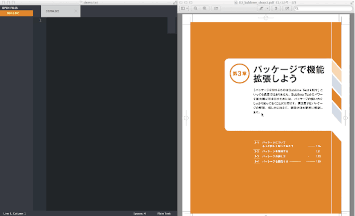

SublimeNFDToNFCPaste
====================

## SublimeNFDToNFCPaste とは

OS X では、マルチバイト文字列を Sublime Text へコピペする際に NFC/NFD の問題により、濁点／半濁点が分割されてしまうといったことが起こります。このパッケージをインストールするだけでそれらの問題が解決できます。

## インストール

### Package Control

しばらくおまちんぐ

### 手動インストール

**Zip 解凍してインストール**: [github](https://github.com/astronaughts/SublimeNFDToNFCPaste) から zip ファイルをダウンロードして、"Packages" フォルダないに解凍すれば OK です。

**Git でインストール**: "Packages" フォルダに下記のコマンドで clone してください。

    git clone git://github.com/astronaughts/SublimeNFDToNFCPaste.git SublimeNFDToNFCPaste
